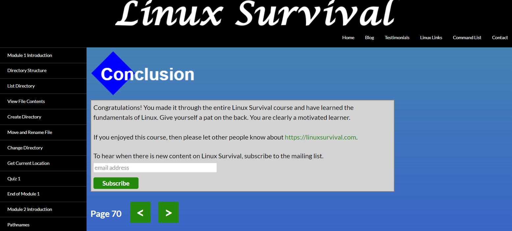
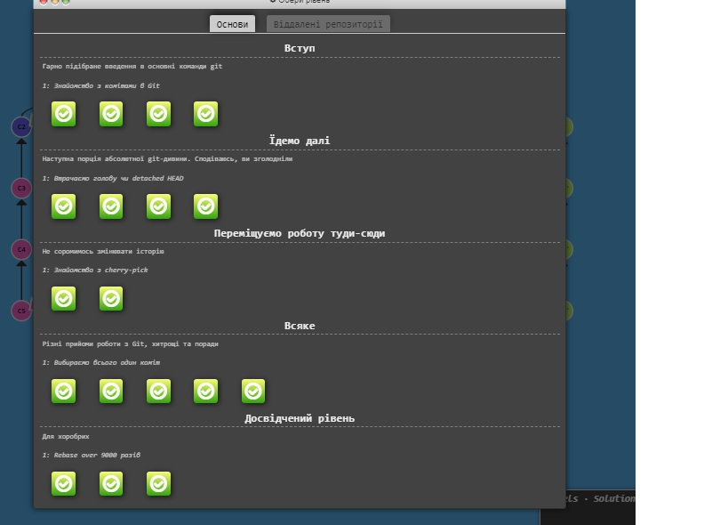
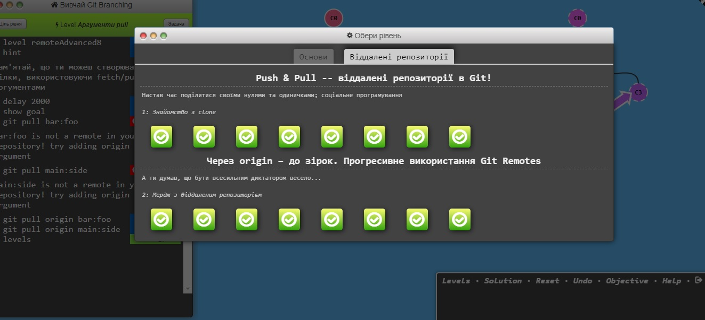
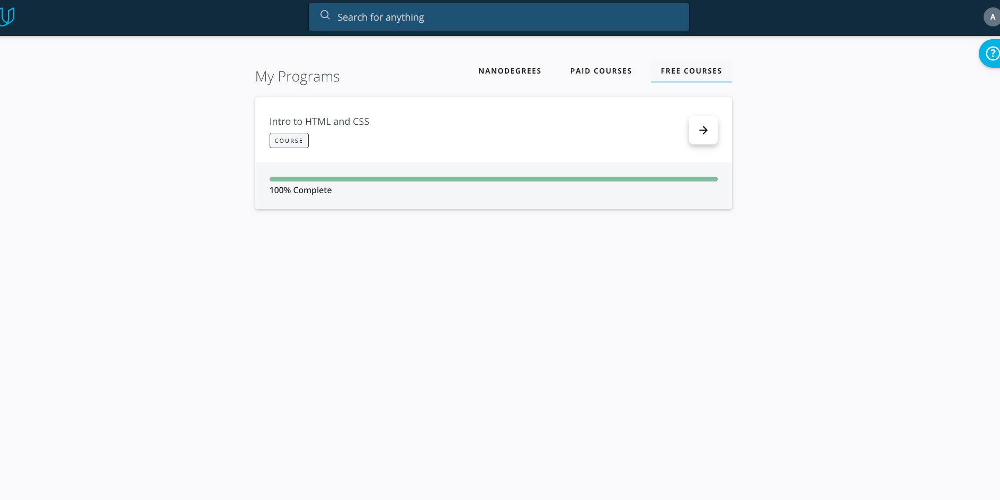
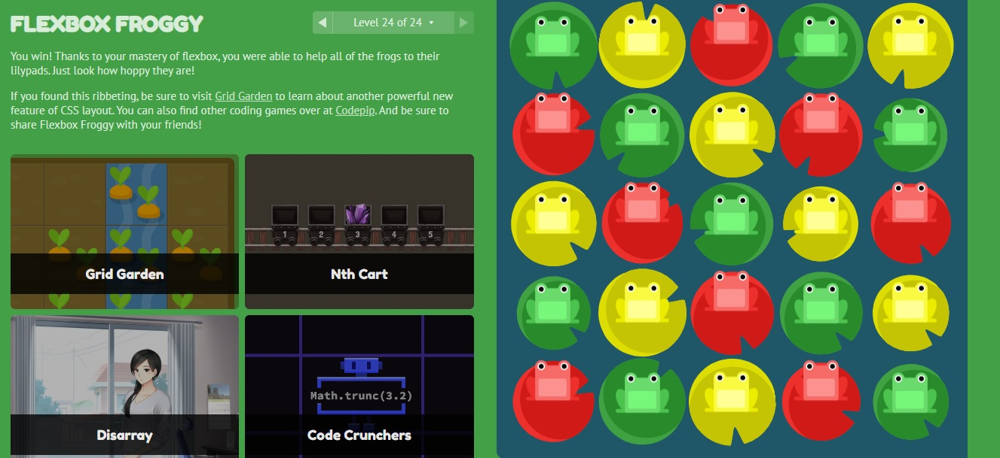
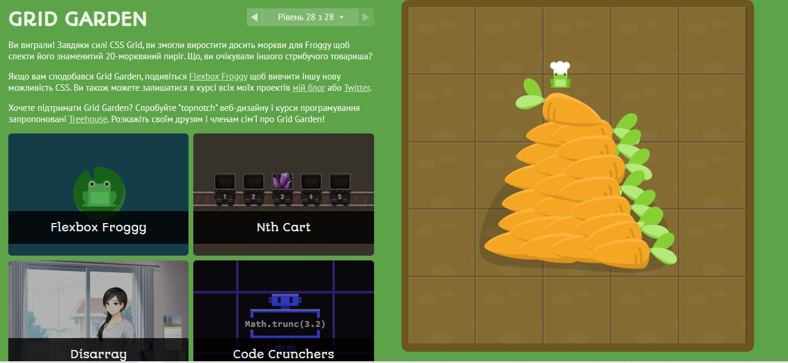
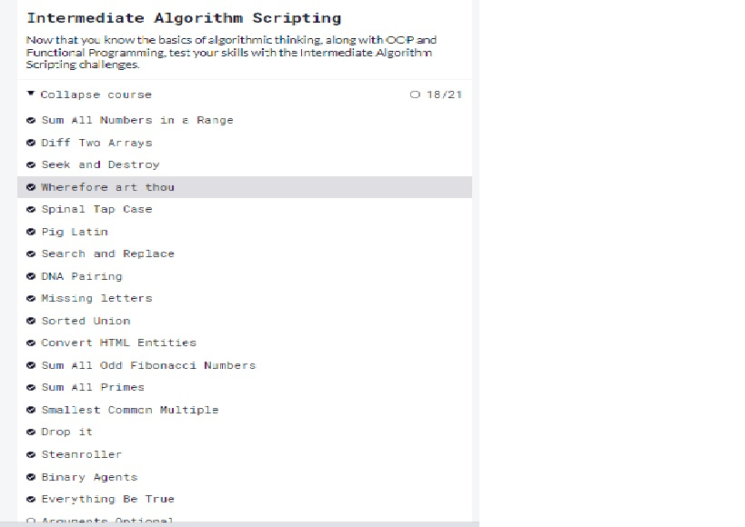

# kottans-frontend

Hello my name Aleksandr. I am from Dnipro (Ukraine).
I am beginner frontend developer. The course about Git was very helpful and  interesting.

# Linux CLI, and HTTP

The tasks were very interesting for me. I will use Linux in future.

## GitHub & Collaboration 

The tasks were very interesting and interactive for me. I tok a lot of pleasures about GitHub. The application of GitHub training is amassing.

## Intro to HTML and CSS
)
The tasks were very interesting and interactive for me.
The lectors were simple to understand. 

## Responsive web design basics

The tasks were very interesting especially FOG game. I used to use flex-box in the PAST.
But I didn't know some features of flex-box and grid, so I will use it in the future.

## DOM

The tasks in this section were quite difficult for me. But I did it. In general, the tasks are varied and interesting. They make you think and read the documentation.