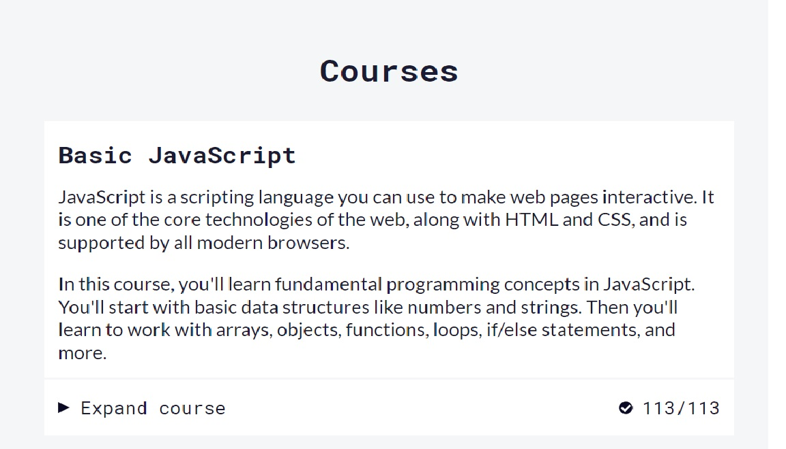
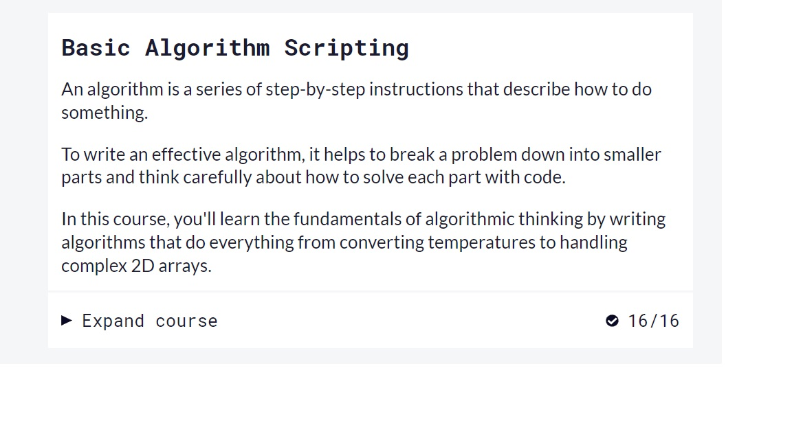
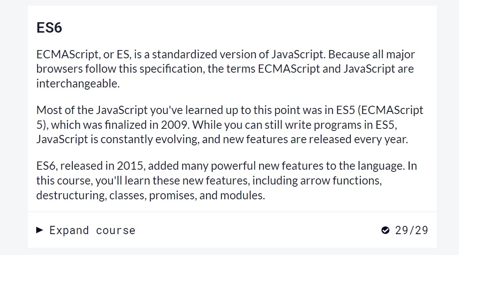
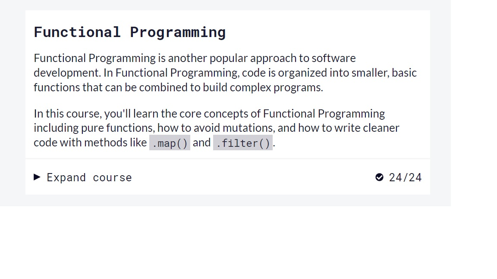
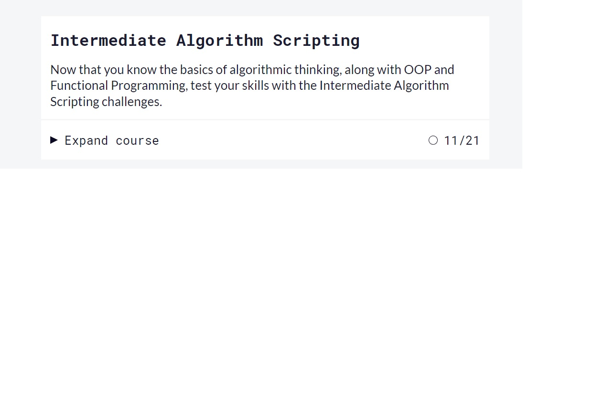
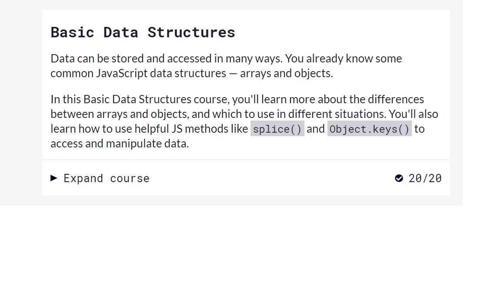
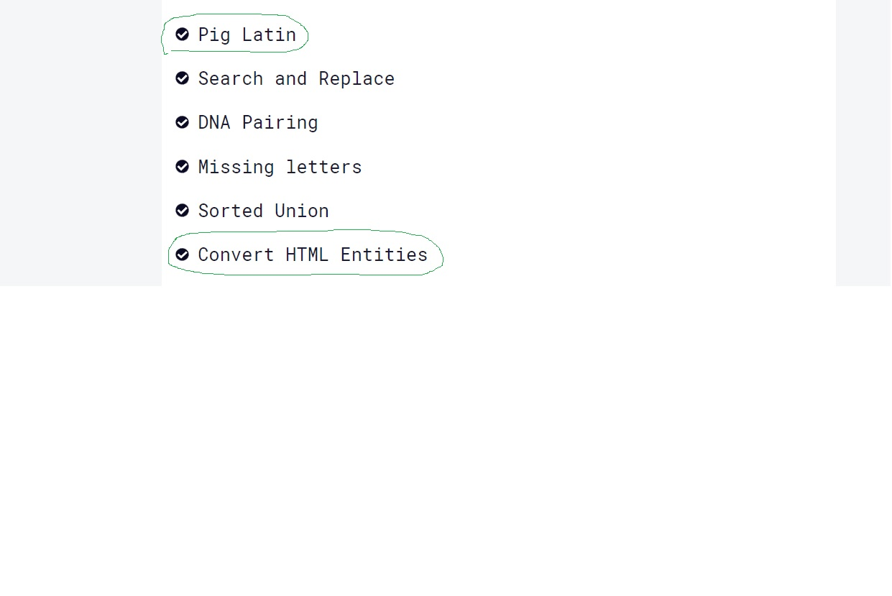

# kottans-frontend

Hello my name Aleksandr. I am from Dnipro (Ukraine).
I am beginner frontend developer. The course about Git was very helpful and  interesting.

# Linux CLI, and HTTP

The tasks were very interesting for me. I will use Linux in future.

## Intro to HTML and CSS
)
The tasks were very interesting and interactive for me. I will use Linux in future.
The lectors were simple to understand. 

## JS Basics
The tasks were very interesting. 
The course 'Вступ до JS' was very usefully.Short videos were very helpful and interesting.
This tasks ('Pig Latin') were very quite difficult but I did it.
https://www.freecodecamp.org/learn/javascript-algorithms-and-data-structures/intermediate-algorithm-scripting/pig-latin
### 'Freecodecamp'
https://www.freecodecamp.org/learn
This course is the best of free of sale courses on Internet.
They ara interesting and interactive. It was amazing and I pump my programming skills.

